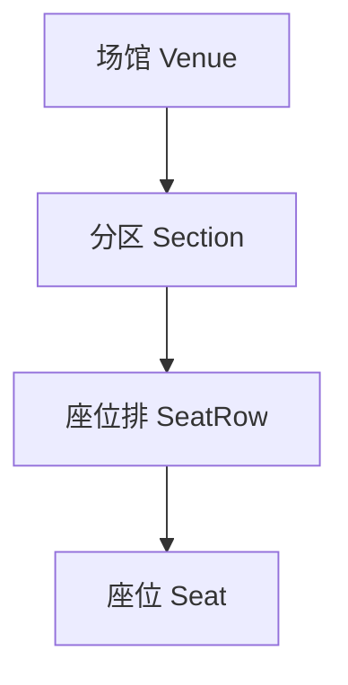
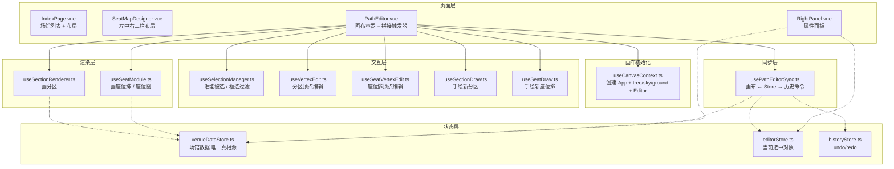
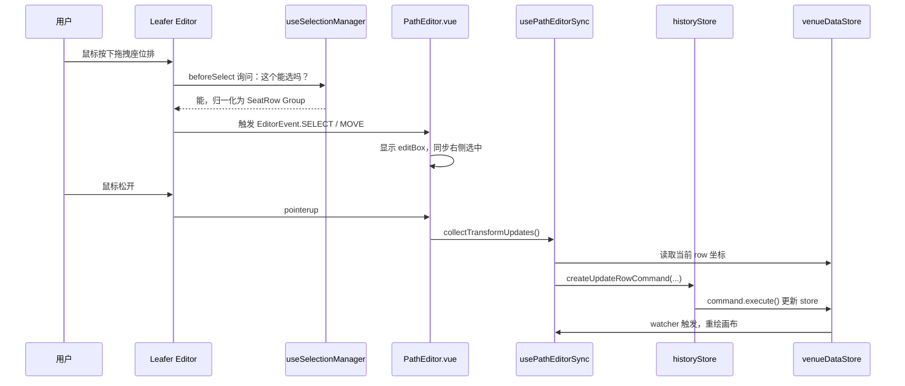

# 座位图编辑器架构文档

## 一句话描述

用户在画布上画分区 → 在分区里画座位排 → 选中分区/排/座位 → 右侧面板改属性。  
功能就是这么简单，但代码里有几层历史包袱让它看起来复杂。

---

## 用户视角：三层对象



| 对象 | 干什么 | 长什么样 |
|---|---|---|
| 分区 | 场馆里的一块区域 | 多边形 path|
| 座位排 | 分区内的一排座位 | 一条线 + 上面若干个圆 |
| 座位 | 最小单位 | 圆 + 编号 |

---

## 代码视角：核心模块



---

## 数据流：一次"拖动用排"发生了什么



---

## 为什么功能简单，代码却复杂？

### 1. 为了性能加了对象池和增量 diff

座位多的时候（几千个），如果每次都销毁重建 DOM/Canvas 元素会卡。所以 `useSeatModule.ts` 里维护了：

- `rowGroupPool`
- `seatEllipsePool`
- `seatLabelPool`

每次数据更新只 diff 变化的部分，复用旧对象。

**如果场馆不大，这层可以删掉，代码会短一半。**

### 2. Leafer Editor 不是为"分区-排-座"模型设计的

Leafer 的 Editor 默认行为：
- 点谁就选中谁
- 框选按包围盒
- Group 默认可以进入内部编辑

但我们需要：
- 点分区里的 Path 要选整个分区
- 座位排的线不能直接选中，要选整排
- 座位圆选中时不能有编辑框
- 框选要按分区/排的真实形状，不是包围盒

所以才有了 `useSelectionManager.ts` 和 `BEFORE_DOWN` 里各种归一化逻辑。

### 3. 我们把数据和视图拆得太开

- 数据在 `venueDataStore`
- 视图在 Leafer 画布
- 选中状态在 `editorStore`
- 历史记录在 `historyStore`

每次改动都要走：

```
画布事件 → 不直接改画布 → 生成 Command → 改 Store → Store watcher → 重绘画布
```

好处是 undo/redo 很干净；坏处是调试时要跳很多文件。

---

## 各文件一句话职责

| 文件 | 职责 |
|---|---|
| `useCanvasContext.ts` | 创建 Leafer 画布，三层（tree/sky/ground）+ Editor |
| `useSectionRenderer.ts` | 把 `Section` 数据画成多边形/矩形/椭圆 |
| `useSeatModule.ts` | 把 `SeatRow` 数据画成排线和座位圆 |
| `useSelectionManager.ts` | 决定用户点击/框选时真正选中什么 |
| `usePathEditorSync.ts` | 画布选中 → Store；画布拖拽 → 历史命令 |
| `useVertexEdit.ts` | 编辑分区形状的顶点 |
| `useSeatVertexEdit.ts` | 编辑座位排形状的顶点 |
| `useSectionDraw.ts` | 鼠标手绘新分区 |
| `useSeatDraw.ts` | 鼠标手绘新座位排 |
| `venueDataStore.ts` | 场馆数据，唯一真相源 |
| `editorStore.ts` | 当前选中对象的 ID 集合 |
| `historyStore.ts` | undo/redo 命令栈 |

---

## 想简化可以砍哪里？

按复杂度从高到低：

1. **对象池 + 增量 diff**（`useSeatModule.ts`）
   - 小场馆不需要，删掉后每次全量重绘，代码短很多
2. **`App` 三层架构**（`useCanvasContext.ts`）
   - 如果不需要 Editor 和背景/内容分离，可以回到单 Leafer
3. **历史命令中间层**（`usePathEditorSync.ts` + `venueCommands.ts`）
   - 不需要 undo/redo 的话，拖拽完直接写 store 即可
4. **顶点编辑**（`useVertexEdit.ts` / `useSeatVertexEdit.ts`）
   - 如果不需要精细调形状，这两个文件整个删掉

最核心、最不能砍的只有：
- `useCanvasContext.ts`（画布）
- `useSectionRenderer.ts`（画分区）
- `useSeatModule.ts`（画座位）
- `useSelectionManager.ts`（选中归一化）
- `venueDataStore.ts`（数据）
